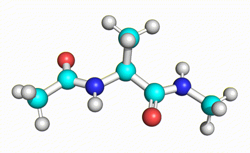
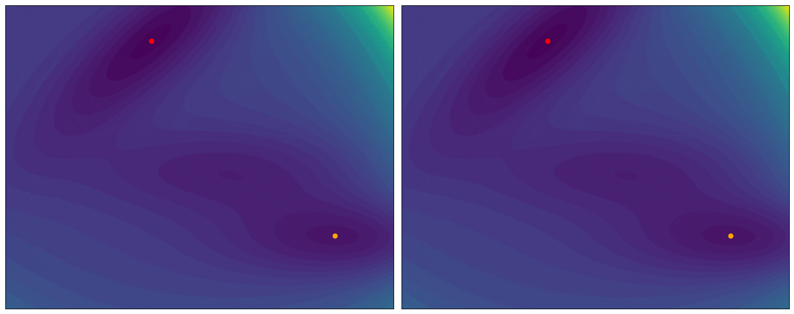

<h1 align="center">Doob’s Lagrangian: A Sample-Efficient Variational Approach to Transition Path Sampling</h1>
<p align="center">
<a href="https://arxiv.org/abs/2410.07974"></a>
<!-- <a href="https://github.com/plainerman/variational-doob"></a> -->
<a href="https://colab.research.google.com/drive/1FcmEbec06cH4yk0t8vOIt8r1Gm-VjQZ0?usp=sharing"></a>
<a href="https://github.com/jax-ml/jax"></a>
</p>
<p align="center">
A novel variational approach to transition path sampling (TPS) based on the Doob’s h-transform. Our method can be used to sample transition paths between two meta-stable states of molecular systems.
</p>
<p align="center">

</p>
<p align="center">
<i>A transition path of alanine dipeptide sampled using our method.</i>
</p>

<p align="center">

</p>
<p align="center">
<i>Visualization of the optimization process using our algorithm for 2D potential.</i>
</p>

<p align="center">

</p>
<p align="center">
<i>Running the deterministic and stochastic simulations using our algorithm for 2D potential.</i>
</p>

## Setup

You can use the `environment.yml` file to setup this project. However, it only works on CPU.
```bash
conda env create -f environment.yml
```

We also provide a requirements.txt, and a pyproject.toml. So if you are using [pixi](https://github.com/prefix-dev/pixi) you can instead run

```bash
pixi install --frozen
```

to install the dependencies and setup a virtual environment. Either activate the environment with `pixi shell` or use the provided `pixi run` command to run the scripts.

## Getting started

The best way to understand our method is to look at [the google colab notebook](https://colab.research.google.com/drive/1FcmEbec06cH4yk0t8vOIt8r1Gm-VjQZ0?usp=sharing) which contains the necessary code for 2D potentials in one place. 
However, this notebook is very limited in scope and only contains the most basic examples. In the following, we will show the interfaces to run more complex examples. You can also look at the setups in the `configs/` folder.

## Running the baselines
You can either use the TPS shooting baselines [provided by us](https://github.com/plainerman/variational-doob/releases/tag/camera-ready), or re-create them by running

```bash
python tps_baseline_mueller.py
PYTHONPATH='.' python eval/evaluate_mueller.py
```

to generate and evaluate transitions for the Müller-Brown toy-potential or use

```bash
python tps_baseline.py --mechanism two-way-shooting --num_paths 1000 --states phi-psi
# num_steps compiles multiple MD steps into a single one. This makes sampling faster but increases startup time. Only really worth it for long running simulations
python tps_baseline.py --mechanism two-way-shooting --num_paths 100 --fixed_length 1000 --states phi-psi --num_steps 50
python tps_baseline.py --mechanism two-way-shooting --num_paths 1000 --states rmsd
PYTHONPATH='.' python eval/evaluate_tps.py
```

for ALDP respectively. 

**Note:** In both cases, you might want to change the paths that you want to generate and evaluate in the baseline or evaluation scripts.

## Run our method
To sample trajectories with our method, we provide ready to go config files in `configs/`. You can run them with

```bash
python main.py --config configs/toy/mueller_single_gaussian.yaml
python main.py --config configs/toy/dual_channel_single_gaussian.yaml
python main.py --config configs/toy/dual_channel_two_gaussian.yaml
```

for the toy examples and

```bash
python main.py --config configs/aldp_diagonal_single_gaussian.yaml
```

for real molecular systems.

## Citation
If you find our work useful, please consider citing our paper:

```bibtex
@inproceedings{du2024doob,
	author = {Du, Yuanqi and Plainer, Michael and Brekelmans, Rob and Duan, Chenru and No{\'e}, Frank and Gomes, Carla P. and Aspuru-Guzik, Al{\'a}n and Neklyudov, Kirill},
	title = {Doob’s Lagrangian: A Sample-Efficient Variational Approach to Transition Path Sampling},
	year = {2024},
	booktitle = {Advances in Neural Information Processing Systems},
}
```
